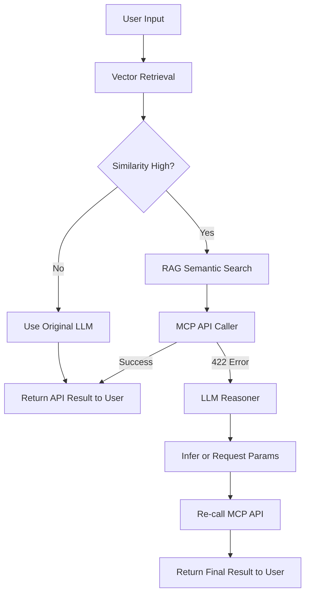

# OpenWebUI-Pipeline
A Manifold RAG pipeline integrating Chroma and LLMs with multi-model routing, conversation memory, and intelligent API parameter recovery.

## 🧠 Overview

This pipeline extends the traditional **RAG (Retrieval-Augmented Generation)** workflow with **intelligent API integration**.  
When an MCP API call fails due to missing parameters, the pipeline uses an **LLM reasoning layer** to:

- Infer missing parameters from conversation history.
- Ask the user for clarification — instead of simply returning a 422 error.

---

## ⚙️ Key Features

✅ **RAG Integration**            – Uses Chroma vector database for semantic search.  
✅ **Ollama / OpenAI Compatible** – Fully compatible with local or remote LLMs.  
✅ **Multi-Model Routing**        – Dynamically switch between models (Ollama, DeepSeek, OpenAI).  
✅ **Conversation Memory**        – Keeps short-term memory (window size = 1) for contextual reasoning.  
✅ **Smart API Recovery**         – When an API returns 422, the LLM analyzes error details and infers or requests parameters.  

---

## How to Run

1. Deploy this pipeline in your OpenWebUI environment.
2. Make sure your Chroma server is running on port `7777` and contains your `documents_api_collection` collection name.
3. Verify that the Chroma Server has the MCPO Server configured for connection.
